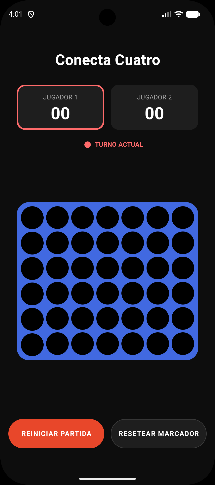
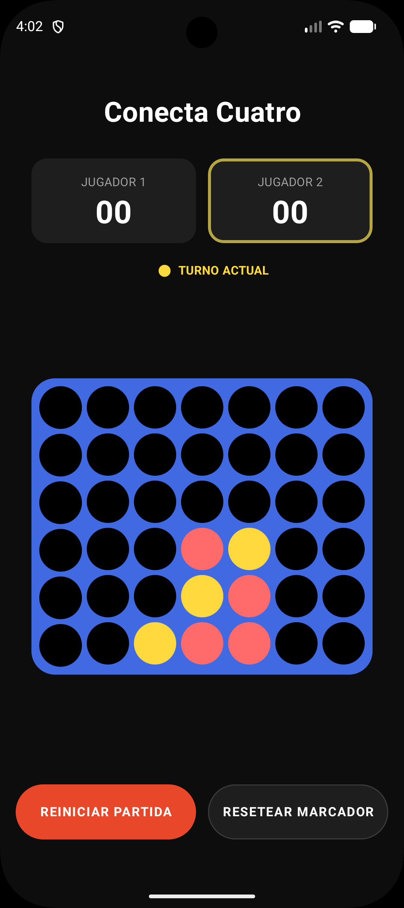
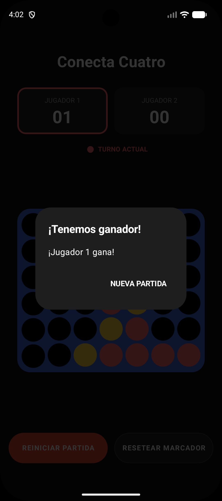

# Connect Four — Android

Implementación del clásico juego **Conecta 4** para Android, construida con Kotlin y Jetpack Compose. Proyecto de portfolio diseñado para demostrar dominio de arquitectura limpia, principios SOLID y metodología de desarrollo guiado por especificaciones (SDD).

---

## Capturas

| Inicio | Partida en curso | Fin de partida |
|:------:|:----------------:|:--------------:|
|  |  |  |

---

## Funcionalidades

- Tablero clásico de **7 columnas × 6 filas**
- **Modo local PvP** — dos jugadores, un mismo dispositivo
- **Turno alternante**: el jugador que pierde una partida empieza la siguiente (no siempre el mismo jugador)
- **Marcador de sesión**: contadores de victorias para cada jugador y partidas totales jugadas, persistidos en memoria durante la sesión
- **Detección de victoria** en las cuatro direcciones: horizontal, vertical y ambas diagonales
- **Detección de empate** cuando el tablero se llena sin ganador
- **Diálogo de fin de partida** con resultado y acceso directo a la siguiente
- **Reinicio de partida** sin perder el marcador de sesión
- **Reinicio completo** de marcadores
- Orientación bloqueada en **portrait** para una experiencia de juego consistente
- UI totalmente **stateless y reactiva** con Jetpack Compose

---

## Arquitectura

El proyecto aplica **MVVM estricto** con separación explícita en tres capas, siguiendo los principios SOLID y GRASP.

```
app/src/main/java/com/example/connectfour/
├── model/          ← Lógica de negocio pura. Sin dependencias de Android.
├── viewmodel/      ← Orquestación de estado. Puente entre modelo y vista.
└── view/           ← UI declarativa. Completamente pasiva y stateless.
```

### Capa Model

Contiene toda la lógica del dominio. No depende de ningún framework, lo que la hace completamente testeable en JVM sin emulador.

| Clase | Responsabilidad |
|-------|----------------|
| `Board` | Tablero inmutable. Expone `dropPiece()` que devuelve un **nuevo** `Board` sin mutar el original. Implementado como `data class`. |
| `CellState` | Enumeración de los tres estados posibles de una celda: `EMPTY`, `RED`, `YELLOW`. |
| `Player` | Enumeración de los dos jugadores: `RED`, `YELLOW`. |
| `GameState` | Enumeración del estado de la partida: `PLAYING`, `WON`, `DRAW`. |
| `WinChecker` | **Interfaz** que define el contrato de detección de victoria. Punto de extensión explícito (OCP + DIP). |
| `ConnectFourWinChecker` | Implementación concreta de `WinChecker`. Detecta 4 en línea en horizontal, vertical, diagonal ↘ y diagonal ↙. |
| `ScoreTracker` | Gestiona el marcador de sesión: victorias por jugador y partidas jugadas. Estado mutable encapsulado, sin exposición directa. |

**Decisión de diseño clave — `WinChecker` como interfaz:**
La lógica de detección de victoria está desacoplada detrás de una interfaz. Esto tiene dos consecuencias directas: (1) el `GameViewModel` depende de una abstracción, no de una implementación concreta, y (2) los tests del ViewModel pueden inyectar un `WinChecker` falso para aislar el comportamiento del ViewModel de la lógica de detección.

### Capa ViewModel

`GameViewModel` es la **única fuente de verdad** (SSOT) para todo el estado de sesión. Expone el estado a la vista mediante un `StateFlow<UiState>` inmutable.

```kotlin
class GameViewModel(
    private val winChecker: WinChecker = ConnectFourWinChecker(),
    private val scoreTracker: ScoreTracker = ScoreTracker()
) : ViewModel()
```

Las dependencias se inyectan por constructor, lo que permite reemplazarlas en tests sin ningún framework de inyección de dependencias externo.

`UiState` es un `data class` inmutable que actúa como snapshot completo del estado de la partida:

```kotlin
data class UiState(
    val board: Board,
    val currentPlayer: Player,
    val gameState: GameState,
    val winner: Player?,
    val nextFirstPlayer: Player,
    val redWins: Int,
    val yellowWins: Int,
    val gamesPlayed: Int
)
```

Cada acción del usuario (`dropPiece`, `resetGame`, `resetScores`) produce un **nuevo `UiState`** mediante `copy()`. El estado anterior nunca se muta.

### Capa View

Construida íntegramente con **Jetpack Compose**. Todos los composables son **stateless**: reciben datos como parámetros y emiten eventos hacia arriba (event hoisting). Ningún composable de la capa view toma decisiones de lógica ni muta datos.

| Composable | Responsabilidad |
|------------|----------------|
| `GameScreen` | Conecta el ViewModel con la UI. Único punto de colección del `StateFlow`. |
| `GameScreenContent` | Raíz de la UI. Recibe `UiState` y callbacks. Testeable sin ViewModel. |
| `BoardView` | Renderiza la cuadrícula y delega el tap de columna al callback `onColumnClick`. |
| `ScoreView` | Muestra el marcador de sesión de cada jugador. |
| `TurnIndicatorView` | Indica visualmente de quién es el turno. |
| `ControlsView` | Botones de reinicio de partida y de marcadores. |
| `WinnerDialogView` | Dialog de fin de partida. Se muestra cuando `gameState != PLAYING`. |

La separación entre `GameScreen` (stateful) y `GameScreenContent` (stateless) es intencional: permite testear toda la UI sin necesidad de un ViewModel real, tal como se hace en `ComposeUiTest`.

---

## Tests

El proyecto sigue un enfoque **TDD**: los tests de cada componente se escribieron antes de la implementación. La cobertura abarca las tres capas.

```
app/src/test/                          ← Tests JVM (sin emulador)
├── model/
│   ├── BoardTest.kt                   # Drop logic, columna llena, reset
│   ├── WinCheckerTest.kt              # Las 4 direcciones de victoria
│   └── ScoreTrackerTest.kt            # Incremento y reset de marcadores
└── viewmodel/
    ├── GameViewModelTest.kt           # Transiciones de estado, drop, victoria
    └── GameViewModelIntegrationTest.kt # Flujos completos de partida (end-to-end JVM)

app/src/androidTest/                   ← Tests instrumentados (requieren dispositivo/emulador)
└── ComposeUiTest.kt                   # Renderizado e interacción con Compose UI
```

```bash
# Tests unitarios e integración (JVM)
./gradlew test

# Tests de UI instrumentados
./gradlew connectedAndroidTest

# Lint
./gradlew lint
```

---

## Metodología de desarrollo — SDD

Este proyecto se desarrolló siguiendo **Spec-Driven Development (SDD)**, una metodología que antepone la especificación y el diseño a la escritura de código.

El flujo aplicado en cada funcionalidad fue:

1. **Exploración** — analizar el impacto del cambio en la arquitectura existente antes de escribir nada
2. **Propuesta** — definir el alcance, el enfoque y los riesgos
3. **Especificación** — documentar el comportamiento esperado en escenarios concretos (formato Given/When/Then)
4. **Diseño técnico** — definir la estructura de clases, contratos e interfaces
5. **Implementación** — escribir el código siguiendo las specs, no al revés
6. **Verificación** — contrastar la implementación contra cada escenario especificado

El asistente de IA actuó como **ejecutor dentro de un marco definido por el desarrollador**: cada decisión de arquitectura, cada contrato de interfaz y cada criterio de aceptación fue establecido por el humano antes de que se escribiera una sola línea de código. SDD asegura que la IA amplifica la productividad sin sustituir el criterio técnico.

---

## Stack tecnológico

| Componente | Tecnología |
|------------|------------|
| Lenguaje | Kotlin |
| UI | Jetpack Compose + Material3 |
| Gestión de estado | `StateFlow` (Kotlin Coroutines) |
| Arquitectura | MVVM estricto |
| Tests unitarios | JUnit 4 + Kotlin Coroutines Test |
| Tests de UI | Compose UI Test (`createComposeRule`) |
| Build | Gradle con Kotlin DSL |
| Min SDK | 24 (Android 7.0) |
| Target SDK | 36 |

---

## Estructura del proyecto

```
ConnectFour/
├── app/
│   └── src/
│       ├── main/java/com/example/connectfour/
│       │   ├── model/
│       │   ├── viewmodel/
│       │   ├── view/
│       │   └── ui/theme/
│       ├── test/          ← Tests JVM
│       └── androidTest/   ← Tests instrumentados
├── AGENTS.md              ← Reglas de arquitectura y convenciones del proyecto
├── build.gradle.kts
└── settings.gradle.kts
```

## Cómo ejecutar

```bash
# Clonar el repositorio
git clone https://github.com/didacum/ConnectFour.git
cd ConnectFour

# Compilar e instalar en dispositivo/emulador conectado
./gradlew installDebug
```

Requiere Android Studio Meerkat o superior, JDK 11+ y un dispositivo o emulador con API 24+.

---

## Licencia

Este proyecto está publicado bajo la licencia [Creative Commons Attribution-NonCommercial 4.0 International (CC BY-NC 4.0)](https://creativecommons.org/licenses/by-nc/4.0/).

Puedes usar, estudiar y adaptar el código libremente con fines no comerciales, siempre que des atribución al autor. **El uso comercial requiere permiso explícito por escrito.**
